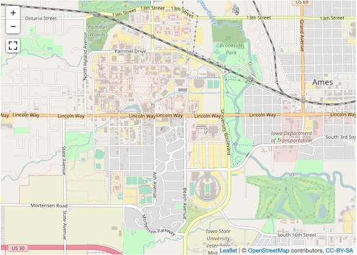

--- 
title: This is an example gitbook
site: bookdown::bookdown_site
output: bookdown::gitbook
documentclass: book
---

# Preface {-}

This is an example gitbook


# Leaflet Map

### Problem
The control buttons in the upper-right corner of the map are not styled correctly. Their transparent background and the missing button image on the lower button are the result of the default `gitbook` css style overriding the `leaflet.extras` style. 

```{r map-example}

library(leaflet)
library(leaflet.extras) #devtools::install_github('bhaskarvk/leaflet.extras')

leaflet() %>% 
        addTiles() %>% 
        setView(-93.65, 42.0285, zoom = 14) %>% 
        addFullscreenControl()


```

### Desired Outcome
I would like for the map controls to look like this instead:

